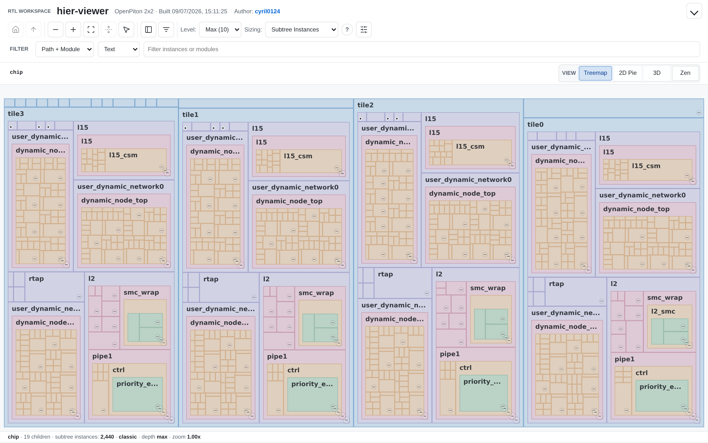
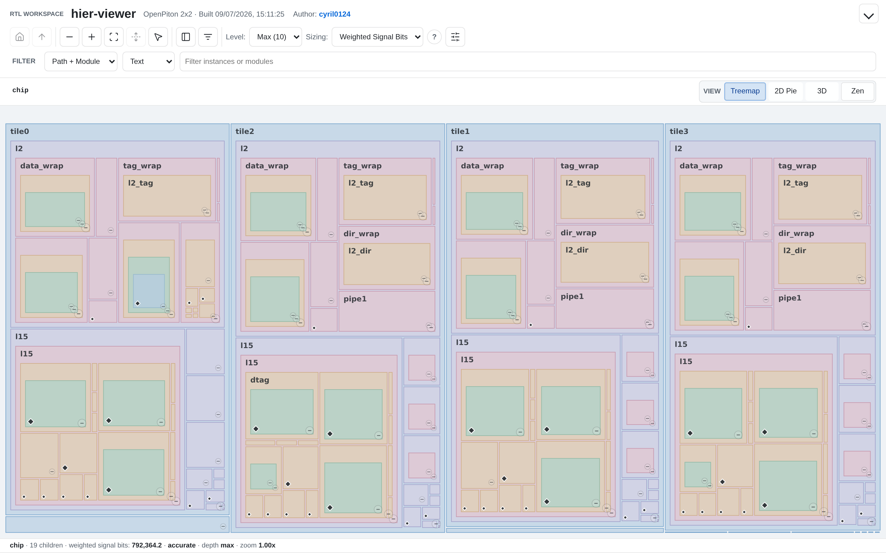
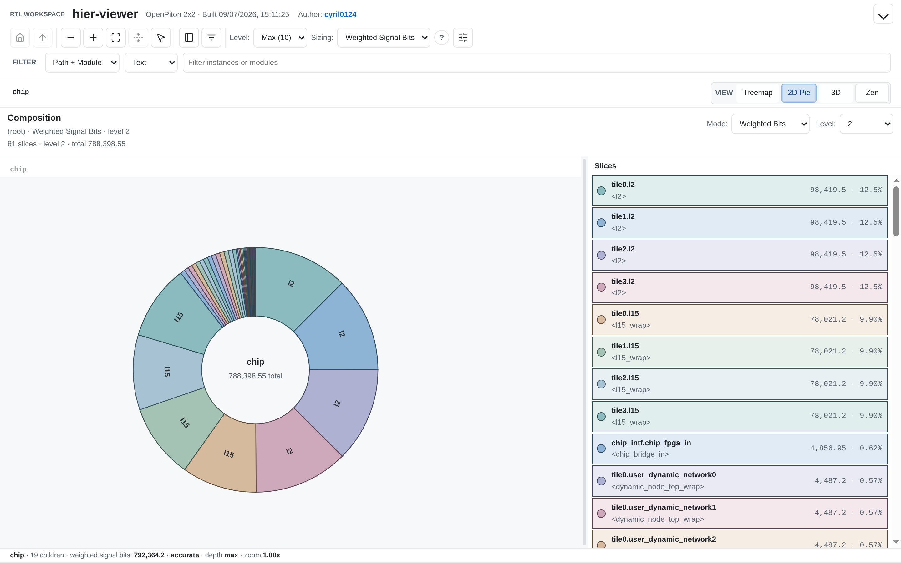
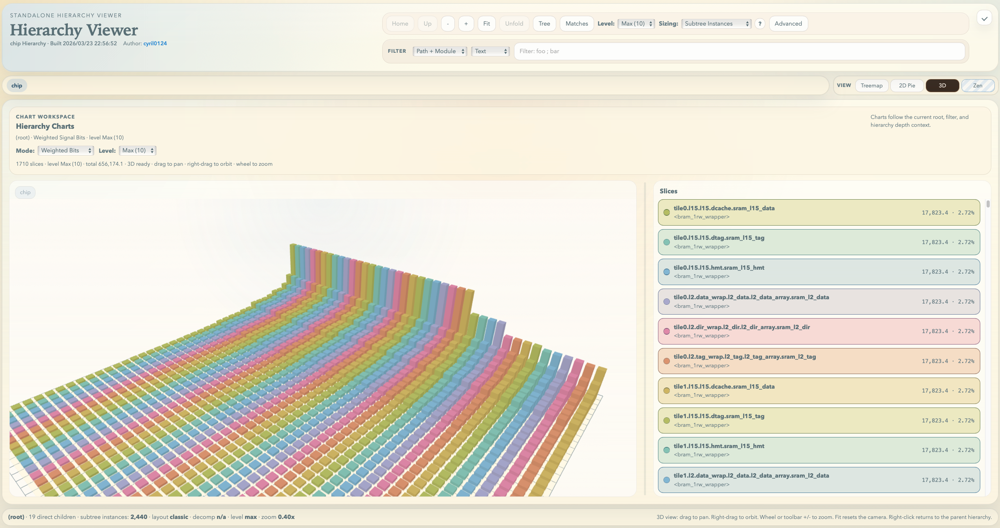
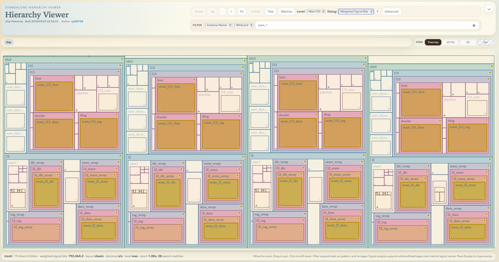
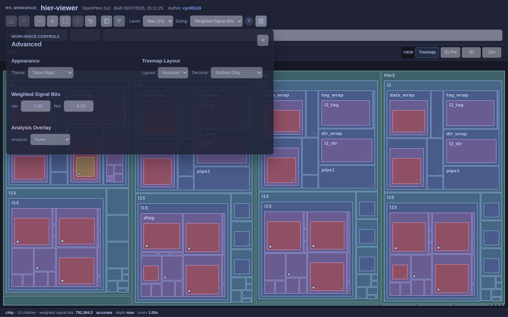
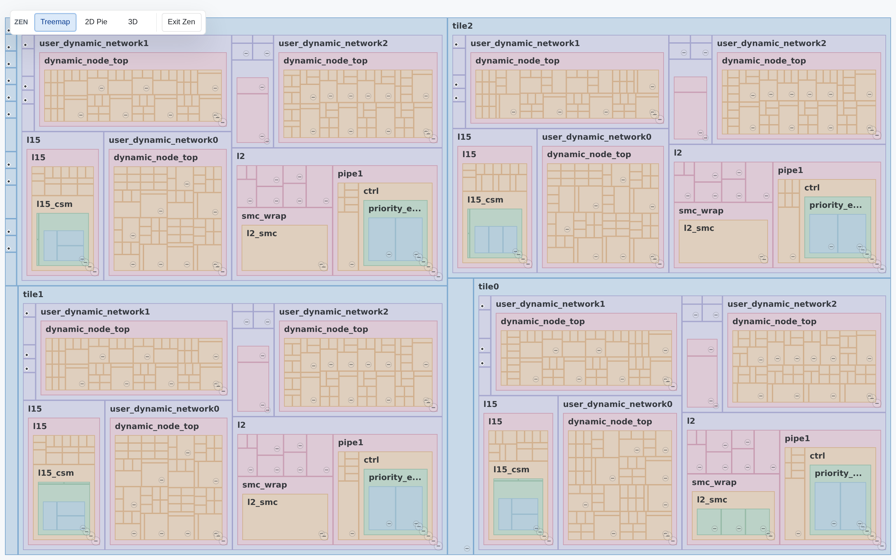
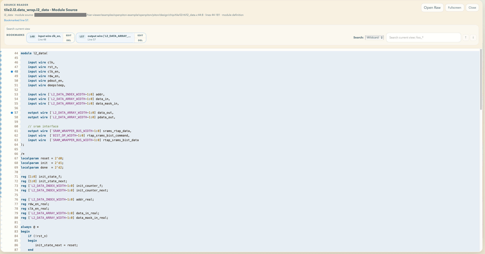

# hier-viewer

[English](README.md)

RTL 层级可视化、结构分析与覆盖率查看工具。

`hier-viewer` 将展开后的实例层级生成为交互式静态站点，用于层级浏览、模块统计比较和 RTL 源码定位。支持矩形树图、2D 饼图和 3D 图表。

内置的 `slang-hier-exporter` 将层级、信号统计和源码位置导出至 SQLite。Rust 程序读取导出结果，或通过 `--db` 指定的已有数据库，生成静态站点。浏览和浏览器文件覆盖率导入仅需 HTTP 文件服务器；可选的服务端 VDB 转换使用内置本地服务。

[安装](#安装) · [快速开始](#快速开始) · [覆盖率](#覆盖率) · [常见命令](#常见命令) · [开发者说明](#开发者说明)

## 安装

### 发布版二进制

1. 从 [GitHub Releases](https://github.com/cyril0124/hier-viewer/releases/latest) 下载对应平台的压缩包。
2. 将 `hier-viewer` 或 `hier-viewer.exe` 解压至 `PATH` 包含的目录。
3. 验证安装：

   ```bash
   hier-viewer --help
   ```

发布版二进制已内置导出器，运行时不需要 Rust、CMake 或 C++ 编译器。

### 使用 Cargo 安装

安装[源码构建依赖](#依赖要求)后执行：

```bash
cargo install --git https://github.com/cyril0124/hier-viewer --locked
```

从本地源码目录安装：

```bash
cargo install --path . --locked
```

如果只构建、不安装，执行 `cargo build --release --locked`，并将下文命令中的 `hier-viewer` 替换为 `./target/release/hier-viewer`。

### 更新可执行文件

```bash
hier-viewer update
```

该命令从 GitHub 下载最新稳定版并替换当前可执行文件，同时报告下载、解包和安装进度。指定发布版本：

```bash
hier-viewer update --to v1.0.0
```

## 快速开始

1. 启动交互式配置向导：

   ```bash
   hier-viewer --output out --preview
   ```

2. 配置 RTL 路径、文件列表和编译参数。向导支持 `Literal`、`Wildcard`、`Regex` 路径匹配，以及 `-I`、`-D`、`+incdir+`、`--top` 等参数。
3. 生成完成后，访问终端输出的 URL。本机桌面环境下，程序也会尝试启动默认浏览器。按 `Ctrl-C` 可停止预览服务。

仅在交互式终端中，且未提供 RTL 输入、文件列表或 `--db` 时，工具才会打开向导。脚本和 CI 必须显式传入这些输入。

## 功能说明

### 经典矩形树图



矩形树图以嵌套区域呈现实例层级，支持从顶层逐级进入具体实例。层级树和过滤结果提供辅助导航。

### 加权矩形树图



加权信号位数用于衡量模块的相对规模，不代表综合后的单元面积或物理布局。选择 `Weighted Signal Bits` 时，默认启用按权重分配区域面积的 `Accurate` 布局。

### 2D 饼图



饼图根据所选统计指标、层级根节点和显示深度，呈现各模块的占比。

### 3D 图表



3D 图表以柱状结构呈现模块统计，支持交互式旋转。图中采用加权信号位数作为统计指标。

### 实例过滤



实例过滤高亮显示匹配节点，并保留周围层级作为上下文。图中选择了匹配 `sram_*` 的实例。

### 设置与主题



可配置布局与分解模式、源码行数 `LOC` 或加权信号位数指标、信号分析模式及权重系数。内置主题包括 Tokyo Night。浏览器保存界面设置和层级折叠状态，刷新后仍然有效。

### Zen 模式



Zen 模式隐藏大部分界面控件，扩大可视化显示区域。

### 源码阅读器



源码阅读器支持定位实例声明和模块定义，并提供文件内搜索、自定义标签书签、原始源码访问及全屏显示。浏览器保存书签，刷新后仍然有效。

## 覆盖率

使用与仿真一致的 RTL 和配置生成层级站点，再导入覆盖率。支持 Line、Condition、Branch、Toggle；报告包含断言覆盖率时，还会显示 Assert。

### 纯命令行预加载覆盖率

生成站点时传入报告目录：

```bash
hier-viewer -f rtl/files.f --no-wizard \
  --output out \
  --coverage-report /path/to/urgReport \
  --preview -- --top Top
```

页面打开后直接显示覆盖率，不需要点击 **Import coverage**。查看器会按完整子层级的实例名和结构，自动选择唯一匹配的报告根节点。多个根节点匹配时，添加 `--coverage-root tb_top.u_dut` 指定目标报告实例；没有匹配时，根据列出的路径检查报告和设计输入。匹配和报错在页面加载时执行。覆盖率参数应放在 `--` 之前，也可与 `--db` 输入配合使用。去掉 `--preview` 即只生成静态站点，供 CI 或其他 HTTP 服务器部署。

VDB 可直接通过 `--coverage-vdb` 传入，与 `--coverage-report` 二选一：

```bash
hier-viewer -f rtl/files.f --no-wizard \
  --output out \
  --coverage-vdb /path/to/simv.vdb \
  --preview -- --top Top
```

VDB 转换需要 Linux、`PATH` 中的 `urg` 和相应 Synopsys 许可证。保持输出目录不变：VDB 未变化时，复用 `out/.hier-viewer-cache/coverage/` 中的报告，不再启动 URG。输入文件元数据、URG 可执行文件和转换参数决定缓存是否有效。`--rebuild-coverage` 强制转换；`--coverage-timeout <分钟>` 默认 60 分钟，`0` 表示不限时。详细规则见 [VDB 缓存说明](docs/coverage.md#cli-vdb-cache)。

两种输入方式都会将报告 XML/HTML 复制进 `out`，移动站点或刷新页面后仍可自动加载。实例映射和报告校验在页面加载时执行。预加载站点也可通过 `--preview-host 0.0.0.0` 提供远程静态访问，细节见[预加载部署说明](docs/coverage.md#preloaded-static-deployment)。

### 通过浏览器导入

1. 按[快速开始](#快速开始)生成并打开层级站点。已有 `out` 站点时，运行 `hier-viewer serve out`，访问终端输出的 HTTP URL。
2. 点击 **Import coverage**，选择 **URG report files**，通过 **Choose folder** 选中 `urgReport` 目录。
3. 将 **Coverage root** 设为报告中的完整实例路径，例如 `tb_top.u_dut`，并选择对应的 **Target hierarchy**。点击 **Check mapping**，检查未匹配实例后点击 **Apply**。
4. 选择 **Coverage** 指标查看层级着色。点击图例区间可过滤实例，支持多选；**Show all** 清除区间过滤。打开实例的 **Module Source**，查看 Line 逐行覆盖率，或切换 Condition、Branch、Toggle 和可选的 Assert 明细页签。

仅选择 `session.xml` 时只能查看层级汇总；源码和表格明细需要报告中的 HTML 文件。浏览器选择的文件在本地读取，不会上传。

源码目录变化时，查看器会核对文件名及报告中所有带行号的源码片段。全部匹配才显示逐行标记，文本不一致时禁用标记。矩形图和 2D 饼图保留结构面积，3D 默认使用固定 0–100% 覆盖率柱高，并按覆盖率从高到低排序。

### 在网页中转换 VDB

在保存 VDB 的 Linux 机器上，通过回环地址启动已有站点：

```bash
hier-viewer serve out --host 127.0.0.1 --port 8000
```

访问终端输出的 URL。在 **Import coverage** 中选择 **VDB server directory**，填写该机器上的 VDB 路径，点击 **Load report**，再按上述步骤检查并应用层级映射。服务端需要 `PATH` 中有可执行的 `urg`，并具备相应 Synopsys 许可证；导入框可设置超时或取消任务。

已有服务端报告可选择 **URG report server directory** 并填写路径。这些服务端导入功能仅在绑定回环地址时可用；`--host 0.0.0.0` 仅提供静态访问和浏览器文件导入。远程 VDB 转换使用 [SSH 转发连接本地服务](docs/coverage.md#import-a-vdb-or-server-report)。

### 选中覆盖率并复制给 AI

1. 在 **Module Source** 中选择指标页签，勾选需要的条目；也可点击 **Select uncovered**，一次加入当前指标全部分页的未覆盖条目，包括部分覆盖的 Line 行。
2. 切换页签或分页继续选择。**Clear selection** 清空选择；切换实例、源码视图或报告也会清空。
3. 点击 **Export selected** 预览 Markdown，再点击 **Copy Markdown** 粘贴给 AI，或通过 **Download .md** 下载文件。

导出包含实例路径、报告指标、原始表头、选中条目及可定位的源码上下文。自动复制不可用时，预览文本会被选中，便于手动复制。查看器不会自动向 AI 服务发送数据。

预加载报告、映射规则、源码校验、断言语义及格式限制见[覆盖率使用指南](docs/coverage.md)。

## 示例

- [`examples/ibex-example`](examples/ibex-example) 提供 `ibex_top` 和 `ibex_simple_system` 的启动脚本，使用固定版本的 `lowRISC/ibex` 子模块和静态文件列表。
- [`examples/openpiton-example`](examples/openpiton-example) 使用开源工具链，为固定的 2x2 OpenPiton 芯片配置生成文件列表。

## 输入模式

### RTL 文件与文件列表

RTL 输入模式接受文件、目录、通配符模式和文件列表。程序复用有效的 SQLite 导出缓存，或调用 `slang-hier-exporter --sqlite` 重建缓存，再生成静态站点。

RTL 位置参数采用 `Wildcard` 匹配，同时接受精确路径和目录。输入解析方式决定是否需要建立整个工作区的 RTL 索引：

| 输入方式 | 工作区 RTL 索引 |
| --- | --- |
| 仅文件列表、字面路径、目录或绝对 glob | 不需要 |
| 相对 glob 或交互式向导 | 需要 |

`Regex` 路径匹配通过向导配置。

统计以各实例展开后的参数和生效的 generate 分支为准。经 slang 判定为等价的实例体共享统计缓存；不同参数配置可产生不同的信号位宽和数量。

### 已有 SQLite 数据库

```bash
hier-viewer --db path/to/hiers.db --output out --preview
```

`--db` 与 RTL 输入及文件列表互斥。该模式直接读取数据库，不重新解析 RTL，也不验证导出缓存。仍需通过 `--output` 指定静态站点的输出目录。

生成期间必须能够读取数据库引用的源码文件，程序会将其副本纳入站点。RTL 修改后，需通过 RTL 输入模式重新生成数据库，以获得更新后的统计结果。

## 常见命令

### 传入 RTL 文件

```bash
hier-viewer rtl/top.sv rtl/core.sv --output out --preview
```

### 使用通配符

通配符模式需加引号，以避免 shell 提前展开：

```bash
hier-viewer 'rtl/**/*.sv' 'tb/**/*.v' --output out --preview
```

### 传入编译参数

`--` 后的参数转发至内置导出器，由 slang 处理。`--output`、`--db`、`--debug` 等程序参数必须位于 `--` 之前。

```bash
hier-viewer \
  'rtl/**/*.sv' \
  --output out \
  -- \
  --top Top \
  -I rtl/include \
  -D SYNTHESIS=1 \
  +incdir+third_party/include
```

### 使用文件列表

重复 `-f` 可添加多个文件列表：

```bash
hier-viewer -f rtl/files.f -f tb/files.f --output out -- --top SimTop
```

文件列表也可与 RTL 位置参数组合使用：

```bash
hier-viewer \
  -f rtl/files.f \
  'rtl/generated/**/*.sv' \
  --output out \
  -- \
  +incdir+rtl/include
```

### 重建导出缓存

```bash
hier-viewer -r 'rtl/**/*.sv' --output out -- --top Top
```

常规源码和依赖变化会自动触发重建。需要显式指定 `-r` 的情况，见[缓存失效限制](docs/export-and-bundle-contracts.md#cached-source-dependencies)。

## 命令行参考

```text
hier-viewer [OPTIONS] [rtl ...]
hier-viewer serve <output-dir> [--host IP] [--port N]
```

完整参数列表见 `hier-viewer --help`。

| 参数 | 含义 |
| --- | --- |
| `[rtl ...]` | RTL 路径，或由查看器解析的通配符模式 |
| `--db <file>` | 读取预构建的 SQLite 数据库 |
| `-f, --filelist <file>` | 添加文件列表，可重复 |
| `-o, --output <dir>` | 输出目录，必填 |
| `-r, --rebuild-sqlite` | 忽略导出缓存并重建 |
| `--preview` | 生成后启动预览服务 |
| `--preview-host <h>` | 绑定地址，默认 `127.0.0.1` |
| `--preview-port <n>` | 起始端口，默认 `8000`，占用时自动顺延 |
| `--coverage-report <dir>` | 将 URG 报告复制进生成站点，打开页面时自动加载 |
| `--coverage-vdb <dir>` | 用 URG 转换 VDB，未变化时复用缓存；与 `--coverage-report` 互斥 |
| `--rebuild-coverage` | 强制重新转换，需配合 `--coverage-vdb` |
| `--coverage-timeout <分钟>` | VDB 转换超时，默认 60 分钟；`0` 表示不限时 |
| `--coverage-root <path>` | 可选报告实例路径，默认自动选择唯一匹配的层级；需配合覆盖率输入 |
| `--no-wizard` | 禁用向导，要求显式输入 |
| `-t, --title <text>` | 自定义页面标题 |
| `--debug` | 启用查看器调试叠加层，例如 UI 标签 |
| `-- <args...>` | 将剩余参数转发至内置导出器 |

## 依赖要求

源码构建需要：

- Rust 工具链
- CMake 和 Ninja
- 支持 C++20 的编译器
- SQLite3 和 zlib 开发库

Ubuntu 上安装 CI 使用的原生依赖：

```bash
sudo apt-get install cmake ninja-build g++ pkg-config libsqlite3-dev zlib1g-dev
```

### 内置导出器

首次 Cargo 构建还会编译 C++ 导出器，并将其嵌入 Rust 可执行文件。默认通过 CMake `FetchContent` 下载并编译 [slang](https://github.com/MikePopoloski/slang)。

使用本地 `slang` 源码时，在构建前设置：

```bash
export HIER_VIEWER_EXPORTER_SLANG_SOURCE_DIR=/path/to/slang
```

默认开启 `HIER_VIEWER_EXPORTER_FULLY_STATIC=1`。Linux 上生成完全静态链接的导出器；Windows 上还会选择静态 MSVC 运行库。macOS 上静态链接 `slang`，但仍使用系统动态链接器，因为 Apple 不支持完全静态链接的可执行文件。

关闭静态链接偏好：

```bash
export HIER_VIEWER_EXPORTER_FULLY_STATIC=0
```

## SQLite 缓存

RTL 输入模式将 SQLite 导出缓存存储在 `<output>/.hier-viewer-cache/`。多次运行使用同一输出目录时，可复用该缓存。

缓存校验涵盖 RTL 路径、文件大小与修改时间、文件列表、编译参数及导出器指纹，同时检查已记录的源码依赖，包括头文件。命令行日志报告缓存复用或重建的原因。

使用 `-r` / `--rebuild-sqlite` 强制导出。失效规则和限制见[源码依赖缓存](docs/export-and-bundle-contracts.md#cached-source-dependencies)。`--db` 跳过缓存验证。

## 输出目录

```text
out/
├── index.html
├── viewer-meta.json
├── viewer-core.bin
├── viewer-analysis.bin        # 仅在存在分析数据时生成
├── viewer-chart.js
├── viewer-coverage.js        # 打开覆盖率导入时加载
├── viewer-three.module.js
├── three.core.js
├── .hier-viewer-sources/      # 源码阅读器使用的源码副本
└── .hier-viewer-cache/        # 仅在从 RTL 导出 SQLite 时生成
```

部署时应保留完整的输出目录，包括 `.hier-viewer-sources/`。浏览器按需加载源码文本和信号分析数据。源码 URL 对空格和保留字符进行编码，详见[源码打包路径](docs/export-and-bundle-contracts.md#source-bundle-paths)。

## 预览

`--preview` 在 `127.0.0.1` 上启动 HTTP 预览服务，起始端口为 `8000`。指定其他起始端口：

```bash
hier-viewer --db path/to/hiers.db --output out --preview --preview-port 9000
```

远程主机可保留默认绑定地址，通过 SSH 或编辑器转发端口。如需直接远程访问，使用 `--preview-host 0.0.0.0` 监听所有网卡。

仅提供已有站点的访问服务，不重新生成：

```bash
hier-viewer serve out --port 8000
```

内置服务也提供本地覆盖率导入。`python3 -m http.server --directory out 8000` 等普通服务器支持静态浏览和浏览器文件导入，但不能执行 URG。非 loopback 绑定会禁用覆盖率 API。

也可使用 VSCode Live Server 托管输出目录，支持通过 VSCode Remote 访问。

站点应通过 HTTP 访问。以 `file://` 打开 `index.html` 可能导致浏览器无法加载二进制资源、源码文本或 `Open Raw` 链接。若通过 HTTP 仍无法加载源码，应检查服务器是否提供了完整的输出目录。

## 开发者说明

从仓库根目录运行：

```bash
cargo run -- --output out --preview
```

交互式终端下会打开向导。非交互式运行需传入源码输入或 `--db`。

### 前端开发

TypeScript 源码位于 `rust-hier-viewer/src/html/frontend/`。前端构建需要 Node.js 22.x 中的 22.12+、24.x 或 26+，以及 npm。

```bash
npm ci
npm run typecheck
npm run build
cargo run -- --db path/to/hiers.db --output out --preview
```

前端变更需同时包含 `rust-hier-viewer/src/html/generated/` 下重新生成的文件。Cargo 直接嵌入这些文件，不调用 Node；发布版二进制和 Cargo 安装均不需要 Node。构建和打包规则见[前端资源](docs/export-and-bundle-contracts.md#frontend-assets)。

### 验证

除源码构建依赖外，[Linux CI 工作流](.github/workflows/ci.yml) 使用 Node.js 22 和 Python 3。在仓库根目录的 Linux shell 中执行：

```bash
npm ci
npm run typecheck
npm run check:generated
npm test
npx playwright install --with-deps chromium
npm run test:browser
cargo fmt --check
cargo check --locked
cargo clippy --locked --all-targets --all-features -- -D warnings
cargo test --locked --no-run
timeout 60s cargo test --locked
cargo build --locked
npm run test:ui
python3 tests/cache-dependencies.py target/debug/hier-viewer
```

先编译 Rust 测试，再对测试执行施加 60 秒超时。真实导出器的参数化测试及其验证的数据规则，见[定义统计](docs/export-and-bundle-contracts.md#definition-statistics)。

## 相关文档

- [面积策略说明](docs/area-sizing-strategy.md)
- [导出与静态站点契约](docs/export-and-bundle-contracts.md)

## 致谢

内置导出器通过 [slang](https://github.com/MikePopoloski/slang) C++ API 完成 SystemVerilog 解析、语义分析和展开。感谢 slang 作者及贡献者的工作。

本项目全程使用 GPT-5.4 辅助开发，作者负责功能定义与技术指导。
